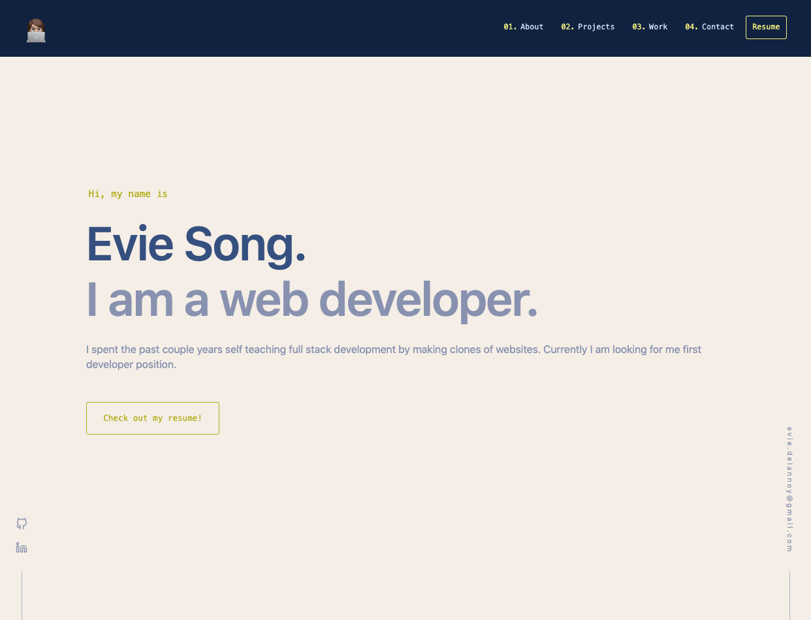

# My Portfolio Website

## Description

Welcome to my portfolio website built with Next.js! This website showcases my personal clone projects, self-teaching programming, and previous experience. 

## Screenshots

## Technologies Used

- Next.js
- React

## Installation

To install and set up this project locally, follow these steps:

1. Clone the repository.
2. Install dependencies using `npm install`.
3. Start the development server using `npm run dev`.
4. Open `http://localhost:3000` in your browser to view the website.

## Deployment

This portfolio website is deployed using GitHub Pages. You can access the live version [here](https://evie-song.github.io/evie-song-portfolio/).

## Project Status

Some of the apps mentioned in this portfolio site are still a work in progress. As a result, the links provided may not always reflect the most up-to-date version of the apps.

## Acknowledgements

This project's design was inspired by the layout and visual elements of [brittanychiang.com](https://brittanychiang.com/).

## Contact

For inquiries or collaboration opportunities, you can reach me at:

- Email: evie.delannoy@gmail.com
- LinkedIn: [linkedin.com/in/evie-song-33b116122/](https://www.linkedin.com/in/evie-song-33b116122/)

